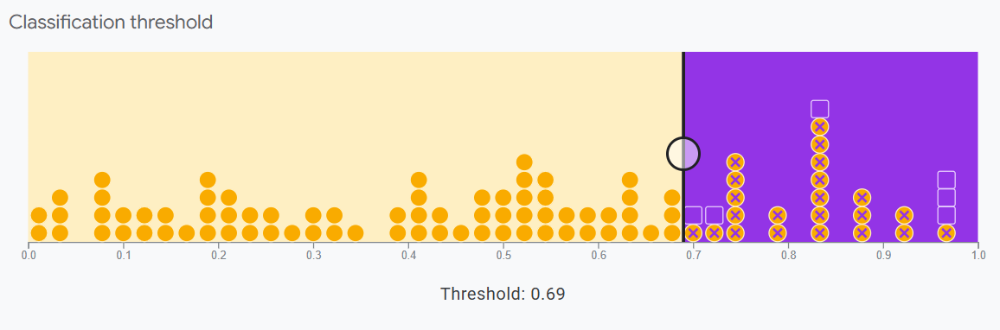

## 🗂️ Clasificación
El modelo de regresión logística situa una probabilidad entre 0 y 1, verdadero o falso.   
En ocasiones buscaremos dividir por categorías.

## 🗂️ Clasificación: Matriz de confusión

La puntuación de probabilidad no es la verdad fundamental. Hay cuatro posibles salidas para un clasificador binario:   

-**Verdadero Positivo**: SPAM clasificado como SPAM.   
-**Verdadero Negativo**: No SPAM clasificado como tal.   
-**Falso Positivo**: Correo que no es SPAM pero se ha clasificado como tal.    
-**Falso Negativo**: Correo SPAM clasificado como no SPAM.  

Cada caso es diferente, en ocasiones querremos minimizar los falsos positivos, en otras ocasiones los falsos negativos... Todo depende de lo que busquemos.   

   

