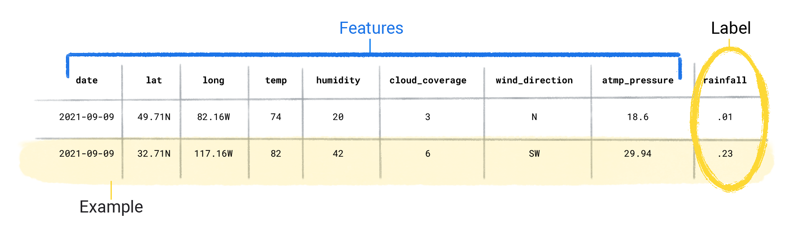

# Datos

## 🗂️ ¿Que importancia tienen los datos?
Los datos son la información más relevante que obtienen los modelos de AA para aprender.

Los conjuntos de datos se componen de ejemplos individuales, cada uno de estos con un atributo y su etiqueta.   
**Los atributos*** son los valores que un modelo supervisado utiliza para predecir la etiqueta.   
**La etiqueta** Es la respuesta que otorga el modelo con los atributos que le hemos dado.  

En una aplicación del tiempo las características podrían ser la latitud, longitud, temperatura... La etiqueta sería la cantidad de lluvia.

Los datos se caracterizan principalmente por tamaño y densidad.  
Tamaño es la cantidad de estos datos y densidad la diferenciación de los mismos.   
Ambos factores son importantes para tener suficientes ejemplos de predicción.

