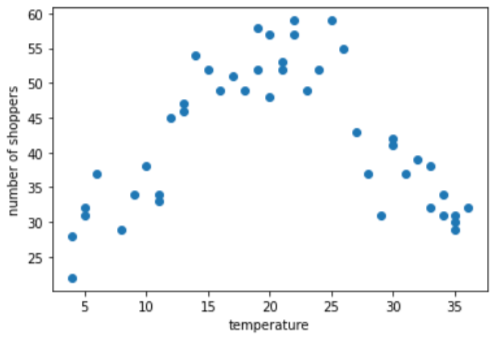
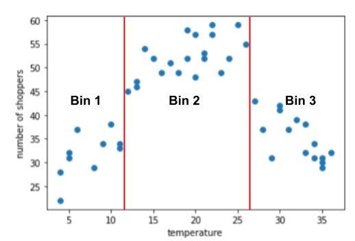

## 🗂️ Datos numericos: Discretización
La discreetización es una técnica que nos permite agrupar por bandejas o buckets.   
Por ejemplo:
- Bandeja 1: 15 a 34  
- Bandeja 2: 35 a 117  
- Bandeja 3: 118 a 279  
- Bandeja 4: 280 a 392  
- Bandeja 5: 393 a 425  

Los modelos entrenados así, no diferenciarán entre 281 y 390 ya que se encuentran dentro de la misma bandeja (la 4).

En el siguiente ejemplo vamos a ver un gráfico de compradores totales y temperatura exterior (en una temperatura más cómoda, más compradores tendremos).   

Podemos agrupar por 3 clusters ampliamente diferenciados:

 

Si tenemos que utilizar más de 3 buckets o los buckets contienen pocos datos no sería buena idea usar esta técnica ya que el modelo nunca aprenderá.