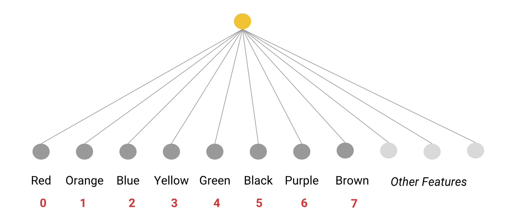

# Datos categoricos

## 🗂️ Como trabajamos con los datos categoricos
Los datos categóricos tienen un conjunto de valores posibles diferenciados, por ejemplo:   
- Las especies de animales de un parque natural.   
- Los nombres de las calles de una ciudad.   
- Si un correo es spam o no spam   
- Las razas de un grupo concreto de perros.   

## 🗂️ Codificación de valores categóricos
Los modelos de AA solo pueden manipular valores flotantes por lo que es importante convertir cada cadena a un valor concreto:

