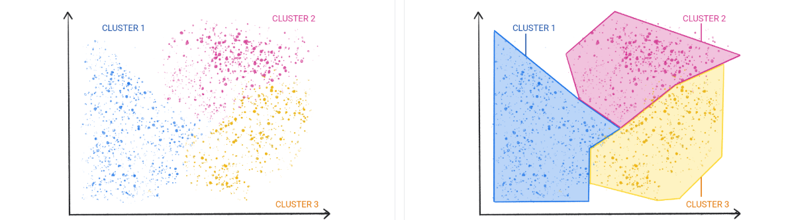

# IA

## 🗂️ ¿Qué es el aprendizaje automático o Machine Learning?
Es el proceso de entrenar un modelo para que realice *preciciones* útiles o *genere contenido*.

**Vamos con un ejemplo:**   
Queremos crear una aplicación de precicción de tiempo, para ello, necesitaríamos evaluar una gran cantidad de fórmulas, parámetros y física para poder llegar a predecirlo de una forma razonable.
Con ML o el aprendizaje automático le podemos entregar a la IA todos los datos para que aprenda y prediga en base a ello.

## 🗂️ Tipos de sistemas de Aprendizaje Automático
>1. Aprendizaje supervisado   
>2. Aprendizaje no supervisado   
>3. Aprendizaje por refuerzo   
>4. IA generativa

#### 1. Aprendizaje supervisado
En los modelos de aprendizaje supervisado se le otorgan respuestas correctas e incorrectas para aprender y descubrir las conexiones entre los elementos.   

Es supervisado porque los humanos le otorgan todos los datos, correctos e incorrectos para reproducir este aprendizaje.

Los casos más comunes de aprendizaje supervisado son:   

-**Modelo de regresión:** Predice un valor numérico.   
*Por ejemplo*, un modelo meteorológico que predice la cantidad de lluvia que cae por región. Otro ejemplo sería un modelo en el que con el tamaño, código postal y otros datos nos predijera el importe de la vivienda.

-**Modelo de clasificación:** Predice si un valor pertenece a una categoría u otra.   
Los modelos de clasificación se dividen en dos grupos, clasificación binaria o multiclase.  
La clasificación binaria genera un valor a partir de una clase que contiene solo dos valores(por ejemplo, rain o no rain).   
La clasificación multiclase general un valor concreto a partir de una clase con más de dos valores(por ejemplo, rain, snow, sleet, hail...).

#### 2. Aprendizaje no supervisado
Los modelos de aprendizaje no supervisado busca como objetivo identificar patrones significativos en los conjuntos de datos que se le entregan.   
Muchos modelos se basan en la técnica de agrupamiento.

La técnica de agrupamiento difiere de la de clasificación porque el modelo no selecciona a que grupo pertenece, solo identifica el patrón y nosotros lo renombramos según nuestra comprensión.

#### 3. Aprendizaje por refuerzo
Los modelos que utilizan el apredizaje por refuerzo realizan predicciones obteniendo recompensas o penalizaciones por ello.   
Uno de los ejemplos de uso es el entrenamiento de robots. 

#### 4. IA generativa
La IA generativa CREA contenido a diferencia de las anteriores vistas.   
*Recordemos:*   
La supervisada, mediante fallos y aciertos ya comprobados aprende(regresion y clasificacion).  
La no supervisada, detecta patrones normalmente mediante agrupación que luego nosotros categorizamos.   
El modelo por refuerzo mediante premios y penalizaciones llegamos a un modelo que afina el resultado.
   
En todos estos casos, tenemos el uso de IA predictiva, que nos da una respuesta para predecir.   
La IA generativa nos entrega contenido creado por ella, desde imágenes, música o video, entre otros.   
   
Toma una variedad de entradas y salidas y según ellas podemos clasificarlas:   

-**Texto a texto:** Nos genera texto tras entregarle una entrada de texto.   
*Por ejemplo*, ¿Me puedes dar una receta de lasaña?
>Cocina láminas de lasaña (si no son precocidas) y prepara una boloñesa dorando cebolla y ajo, añadiendo carne picada hasta que se dore, luego tomate triturado y dejando reducir unos 20 minutos con sal, pimienta y orégano; aparte, haz una bechamel derritiendo mantequilla, añadiendo harina y luego leche poco a poco hasta espesar. ...

-**Texto a imagen:** Tras una entrada de texto nos da una salida en este caso de img.   
*Por ejemplo*, Quiero un pulpo alienigena que flota leyendo el periódico
>

-**Texto a video:** Con una entrada de texto nos entrega un video.   
*Por ejemplo*, un oso de peluche fotorrealista nada en el océano en San Francisco. El oso de peluche se sumerge en el agua. El oso de peluche sigue nadando bajo el agua con peces coloridos. Un oso panda nada bajo el agua.
>

